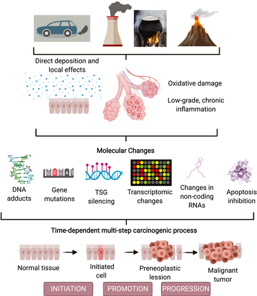

&nbsp;

# Motivation

&nbsp;

## Background and Related Works

Given the rapid progression of climate change, we have seen widespread effects on the environment, in which long-term exposure subsequently have harmful health effects that is a cause for public health concern. Major air pollutants have serious adverse effects on population health and has been linked by substantial evidence to be a large contributor to an increased burden of cancer.

Common air pollutants are responsible for pervasive inflammation throughout the body ([NSW, 2021](https://www.health.nsw.gov.au/environment/air/Pages/outdoor-air-pollution.aspx)), and long-term exposure has been linked to increased mortality for all cancers, but particularly hazardous for cancers of the lung cancer. ([Kim et. al, 2018](https://www.ncbi.nlm.nih.gov/pmc/articles/PMC6266691/)).

Lung cancer is the currently the leading cause of cancer-related mortality and the most commonly diagnosed ([Turner et.al, 2020](https://acsjournals.onlinelibrary.wiley.com/doi/10.3322/caac.21632)). In fact, further exposure to air pollution after lung cancer diagnosis shortens survival compared to those exposed to lower levels of air pollution ([Schiller et. al, 2020](https://ascopubs.org/doi/10.1200/OP.20.00609)).

&nbsp;

## Project Motivations

Current research and trends clearly demonstrate that air pollution is associated with the increase in both incidence and mortality for certain cancers.  Thus, we will to take a closer look at trends of levels of major air pollutants that are of major public health concern [as declared by the WHO](https://www.who.int/health-topics/air-pollution#tab=tab_1): NO2, SO2, CO and 03, and compare these trends to incidence and mortality of lung cancer data by state, with respect to time. 

Our motivation for this project is to more robustly investigate the aforementioned theories by further analyzing and evaluating the associations between pollutants and lung cancer at the population level with respect to time.

The implications of such an analysis can provide justification for further research on the effects of major air pollutants on cancer survival and motivate urgency for environmental policy to slow the progression of climate change to improve quality of life and deleterious consequences on population health. 

Turner et.al (2020): Air Pollution-Related Cancer: Potential Pathways and Mechanisms. 

&nbsp;

# Research Questions 

Some ideas for the questions, not definite

- What is the relationship between incidence rate and mortality rate of different types of cancer?
- What has been the general trend of cancer incidence, cancer mortality, and pollution levels over time?
- What is the geographical spread of cancer incidence and pollution levels in US?
- Is there any evidence of association between cancer incidence (especially lung cancer) and air pollution?

&nbsp;

# Data 

## Data Source

Our project consists of data from two main sources: 

Regarding cancer statistics, we retrieved data from [American Cancer Society Cancer Statistics Center](https://cancerstatisticscenter.cancer.org/#!/). Raw data sets were available for download in excel format. The three data sets give us information on aggregated mortality and incidence rates from 2013 to 2017, aggregated mortality and incidence rates of various cancers at the state level from 2013 to 2017, and trends of mortality related to various cancers over time from 1930 to 2018. According to the file and website, the data source is the North American Association of Central Cancer registries. 

### *Cancer Data Code:*

Average annual rate per 100,000, age adjusted to the 2000 US standard population.

Incidence/Death Rate Per Cancer Type:

- `Cancer Type` : Type of cancer
- `Both sexes combined` : Combined rate for both female and male
- `Female` : Rate for female only
- `Male` : Rate for male only

Incidence/Death Rate Per State:

- `State` : US States including `All U.S. combined` as an observation

- Following columns for each cancer types:

  - `Both sexes combined`
  - `Female`
  - `Male`

The second data set is air pollution data in the United States from 2000 to 2016. The data was gathered by the EPA and measures air pollutant concentrations(in ppb/ppm) for major pollutants at the city/county level. This is an extremely large data set with over 174,000 observations.
[Brief description of the pollution data set](https://data.world/data-society/us-air-pollution-data)

We focused our analyses on the mean values of 4 major pollutants:

- **Nitrogen Dioxide (NO2)** : measured in parts per billion
- **Sulphur Dioxide (SO2)** : measured in parts per billion
- **Carbon Monoxide (CO)** : measured in parts per million
- **Ozone (O3)** : measured in parts per million

### *Pollution Data Code:*

- `State Code `: The code allocated by US EPA to each state
- `County code` : The code of counties in a specific state allocated by US EPA
- `Site Num` : The site number in a specific county allocated by US EPA
- `Address`: Address of the monitoring site
- `State` : State of monitoring site
- `County` : County of monitoring site
- `City` : City of the monitoring site
- `Date Local` : Date of monitoring

- Following Columns Per Each Pollutant:

  - `Units` : The units measured for pollutant
  - `Mean` : The arithmetic mean of concentration of pollutant within a given day
  - `AQI` : The calculated air quality index of pollutant within a given day
  - `1st Max Value` : The maximum value obtained for pollutant concentration in a given day
  - `1st Max Hour` : The hour when the maximum pollutant concentration was recorded in a given day

## Data Cleaning

The pollution data was cleaned to have year, state, and the mean values of the 4 pollutants. In order to match the time period of the pollution data, the mortality trend data was cleaned to have observations from 2000 to 2016 only. 

Cancer incidence and mortality data sets were more difficult to clean for analysis as some observation values included notes along with their numeric values.

&nbsp;

# Exploratory Analysis

For visual plots, check out [Exploratory Analysis](exploratory-analysis.html)!

&nbsp;

# Regression Analysis

&nbsp;

# Discussion

In light of our exploratory and regressed analysis, we attained the following insights:

## Limitations and Challenges

&nbsp;

# Conclusions

