exploratory\_analysis
================
Anand Rajan
12/5/2021

## Exploring Pollution Data Set

``` r
modified_pollution =
  read_csv("data/uspollution_us_2000_2016.csv") %>% 
  janitor::clean_names() %>%
  select(state, date_local, no2_mean, o3_mean, 
         so2_mean, co_mean) %>%
  rename(
    no2=no2_mean,
    co=co_mean,
    o3=o3_mean,
    so2=so2_mean
  ) %>% 
  separate(date_local, into = c("year", "month", "day"), sep = "\\-") %>%
  select(-c("month", "day")) %>%
  group_by(year, state) %>%
  summarize(across(everything(), mean)) %>%
  mutate_if(is.numeric, ~round(., 3)) %>%
  filter(state != "Country Of Mexico") %>%
  group_by(year) %>%
  summarize(across(everything(), mean)) %>%
  select(-c(state)) %>% 
  mutate(
    year = as.numeric(year)
  )
```

    ## New names:
    ## * `` -> ...1

    ## Rows: 1746661 Columns: 29

    ## -- Column specification --------------------------------------------------------
    ## Delimiter: ","
    ## chr   (8): Address, State, County, City, NO2 Units, O3 Units, SO2 Units, CO ...
    ## dbl  (20): ...1, State Code, County Code, Site Num, NO2 Mean, NO2 1st Max Va...
    ## date  (1): Date Local

    ## 
    ## i Use `spec()` to retrieve the full column specification for this data.
    ## i Specify the column types or set `show_col_types = FALSE` to quiet this message.

    ## `summarise()` has grouped output by 'year'. You can override using the `.groups` argument.

    ## `mutate_if()` ignored the following grouping variables:
    ## Column `year`

    ## Warning in mean.default(state): argument is not numeric or logical: returning NA

    ## Warning in mean.default(state): argument is not numeric or logical: returning NA

    ## Warning in mean.default(state): argument is not numeric or logical: returning NA

    ## Warning in mean.default(state): argument is not numeric or logical: returning NA

    ## Warning in mean.default(state): argument is not numeric or logical: returning NA

    ## Warning in mean.default(state): argument is not numeric or logical: returning NA

    ## Warning in mean.default(state): argument is not numeric or logical: returning NA

    ## Warning in mean.default(state): argument is not numeric or logical: returning NA

    ## Warning in mean.default(state): argument is not numeric or logical: returning NA

    ## Warning in mean.default(state): argument is not numeric or logical: returning NA

    ## Warning in mean.default(state): argument is not numeric or logical: returning NA

    ## Warning in mean.default(state): argument is not numeric or logical: returning NA

    ## Warning in mean.default(state): argument is not numeric or logical: returning NA

    ## Warning in mean.default(state): argument is not numeric or logical: returning NA

    ## Warning in mean.default(state): argument is not numeric or logical: returning NA

    ## Warning in mean.default(state): argument is not numeric or logical: returning NA

    ## Warning in mean.default(state): argument is not numeric or logical: returning NA

``` r
modified_pollution %>% 
  knitr::kable(caption="United States Pollutant Concentration from 2000-2016")
```

| year |       no2 |        o3 |       so2 |        co |
|-----:|----------:|----------:|----------:|----------:|
| 2000 | 17.323000 | 0.0250526 | 4.3962632 | 0.5822632 |
| 2001 | 17.670100 | 0.0256500 | 3.5975000 | 0.4763500 |
| 2002 | 15.537136 | 0.0277727 | 2.8994091 | 0.4774545 |
| 2003 | 14.554696 | 0.0266957 | 3.1442174 | 0.4672609 |
| 2004 | 14.944842 | 0.0243684 | 3.2192105 | 0.4366842 |
| 2005 | 15.296632 | 0.0264737 | 3.1294737 | 0.4373158 |
| 2006 | 13.284269 | 0.0259231 | 2.8768462 | 0.3955769 |
| 2007 | 12.208414 | 0.0260345 | 2.4068621 | 0.3721379 |
| 2008 | 10.843862 | 0.0263793 | 1.9670000 | 0.3232069 |
| 2009 |  9.916679 | 0.0255357 | 1.6744286 | 0.3003214 |
| 2010 | 10.668167 | 0.0272667 | 1.4239667 | 0.3099333 |
| 2011 | 10.971667 | 0.0268611 | 1.2288056 | 0.2875000 |
| 2012 | 10.445514 | 0.0280571 | 0.9306000 | 0.2916286 |
| 2013 | 10.187526 | 0.0259737 | 0.9171053 | 0.2610789 |
| 2014 |  9.591073 | 0.0258780 | 1.0114878 | 0.2597317 |
| 2015 |  9.253191 | 0.0259762 | 0.8508333 | 0.2652381 |
| 2016 | 10.988235 | 0.0262941 | 0.6460588 | 0.2801471 |

United States Pollutant Concentration from 2000-2016

``` r
modified_pollution %>% 
  pivot_longer(
    no2:co,
    names_to = "pollutant_type",
    values_to="concentration"
  ) %>% 
  ggplot(aes(x=year,y=concentration, group=pollutant_type, color=pollutant_type)) +
  geom_point() +
  geom_line() +
  scale_color_viridis(discrete=TRUE) +
  theme_bw() +
  labs(
    title="Trends in Polluntant Concentration in the US from 2000-2016",
    x="Year",
    y="Pollutant Concentration(ppm)"
  ) 
```

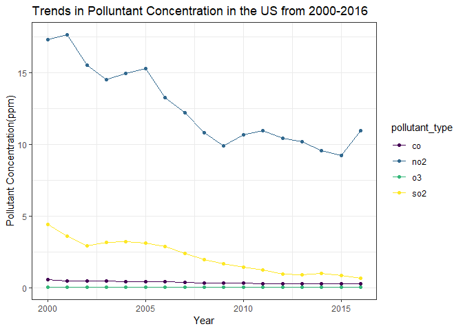<!-- -->

### Exploring the Relationship Between Pollutant Concentration and Death Rate

``` r
read_death_time =
  read_excel("data/DeathTrend.xlsx", 
             skip = 6) %>%
  janitor::clean_names()

x = c("colorectum_female", "colorectum_male", "liver_and_intrahepatic_bile_duct_female", "liver_and_intrahepatic_bile_duct_male", "lung_and_bronchus_female", "lung_and_bronchus_male", "ovary_female", "uterus_cervix_and_corpus_combined_female")

remove_note = function(column_name) {
  read_death_time = read_death_time %>% 
    separate(column_name, into = c(column_name, "note"), sep = "\\-") %>% 
    select(-note)}

for (i in x) {
  read_death_time = remove_note(i)} 
death_time =
  read_death_time %>%
  filter(year %in% 2000:2016) %>%
  select(-c("breast_male", "ovary_male", "prostate_female","uterus_cervix_and_corpus_combined_male")) %>%
  mutate_at(vars(-("year")), as.numeric) %>%
  mutate(year = as.factor(year))
```

``` r
merged_death_pollution=
merge(death_time, modified_pollution, by = "year") 
```

``` r
death_state =
  read_excel("data/DeathRate.xlsx", sheet = "State", 
             skip = 6) %>%
  janitor::clean_names() %>% 
  separate(
    col = breast_both_sexes_combined,
    into = c("breast_total", "female_breast_only"),
    sep = "-"
  ) %>% 
  select(-female_breast_only) %>%
  mutate(
    breast_male = if_else(breast_male == "n/a", "0", breast_male),
    cervix_male = if_else(cervix_male == "n/a", "0", cervix_male),
  ) %>%
  mutate_at(vars(-("state")), as.numeric) %>%
  filter(state != "Puerto Rico")
```

    ## Warning: Expected 2 pieces. Additional pieces discarded in 1 rows [41].

    ## Warning in mask$eval_all_mutate(quo): NAs introduced by coercion

    ## Warning in mask$eval_all_mutate(quo): NAs introduced by coercion

    ## Warning in mask$eval_all_mutate(quo): NAs introduced by coercion

    ## Warning in mask$eval_all_mutate(quo): NAs introduced by coercion

    ## Warning in mask$eval_all_mutate(quo): NAs introduced by coercion

    ## Warning in mask$eval_all_mutate(quo): NAs introduced by coercion

    ## Warning in mask$eval_all_mutate(quo): NAs introduced by coercion

    ## Warning in mask$eval_all_mutate(quo): NAs introduced by coercion

    ## Warning in mask$eval_all_mutate(quo): NAs introduced by coercion

    ## Warning in mask$eval_all_mutate(quo): NAs introduced by coercion

    ## Warning in mask$eval_all_mutate(quo): NAs introduced by coercion

    ## Warning in mask$eval_all_mutate(quo): NAs introduced by coercion

    ## Warning in mask$eval_all_mutate(quo): NAs introduced by coercion

    ## Warning in mask$eval_all_mutate(quo): NAs introduced by coercion

    ## Warning in mask$eval_all_mutate(quo): NAs introduced by coercion

    ## Warning in mask$eval_all_mutate(quo): NAs introduced by coercion

    ## Warning in mask$eval_all_mutate(quo): NAs introduced by coercion

    ## Warning in mask$eval_all_mutate(quo): NAs introduced by coercion

    ## Warning in mask$eval_all_mutate(quo): NAs introduced by coercion

    ## Warning in mask$eval_all_mutate(quo): NAs introduced by coercion

    ## Warning in mask$eval_all_mutate(quo): NAs introduced by coercion

    ## Warning in mask$eval_all_mutate(quo): NAs introduced by coercion

    ## Warning in mask$eval_all_mutate(quo): NAs introduced by coercion

    ## Warning in mask$eval_all_mutate(quo): NAs introduced by coercion

    ## Warning in mask$eval_all_mutate(quo): NAs introduced by coercion

    ## Warning in mask$eval_all_mutate(quo): NAs introduced by coercion

    ## Warning in mask$eval_all_mutate(quo): NAs introduced by coercion

    ## Warning in mask$eval_all_mutate(quo): NAs introduced by coercion

    ## Warning in mask$eval_all_mutate(quo): NAs introduced by coercion

    ## Warning in mask$eval_all_mutate(quo): NAs introduced by coercion

    ## Warning in mask$eval_all_mutate(quo): NAs introduced by coercion

    ## Warning in mask$eval_all_mutate(quo): NAs introduced by coercion

    ## Warning in mask$eval_all_mutate(quo): NAs introduced by coercion

    ## Warning in mask$eval_all_mutate(quo): NAs introduced by coercion

    ## Warning in mask$eval_all_mutate(quo): NAs introduced by coercion

    ## Warning in mask$eval_all_mutate(quo): NAs introduced by coercion

    ## Warning in mask$eval_all_mutate(quo): NAs introduced by coercion

    ## Warning in mask$eval_all_mutate(quo): NAs introduced by coercion

    ## Warning in mask$eval_all_mutate(quo): NAs introduced by coercion

    ## Warning in mask$eval_all_mutate(quo): NAs introduced by coercion

    ## Warning in mask$eval_all_mutate(quo): NAs introduced by coercion

    ## Warning in mask$eval_all_mutate(quo): NAs introduced by coercion

    ## Warning in mask$eval_all_mutate(quo): NAs introduced by coercion

    ## Warning in mask$eval_all_mutate(quo): NAs introduced by coercion

    ## Warning in mask$eval_all_mutate(quo): NAs introduced by coercion

    ## Warning in mask$eval_all_mutate(quo): NAs introduced by coercion

    ## Warning in mask$eval_all_mutate(quo): NAs introduced by coercion

    ## Warning in mask$eval_all_mutate(quo): NAs introduced by coercion

    ## Warning in mask$eval_all_mutate(quo): NAs introduced by coercion

    ## Warning in mask$eval_all_mutate(quo): NAs introduced by coercion

    ## Warning in mask$eval_all_mutate(quo): NAs introduced by coercion

    ## Warning in mask$eval_all_mutate(quo): NAs introduced by coercion

    ## Warning in mask$eval_all_mutate(quo): NAs introduced by coercion

    ## Warning in mask$eval_all_mutate(quo): NAs introduced by coercion

    ## Warning in mask$eval_all_mutate(quo): NAs introduced by coercion

    ## Warning in mask$eval_all_mutate(quo): NAs introduced by coercion

    ## Warning in mask$eval_all_mutate(quo): NAs introduced by coercion

    ## Warning in mask$eval_all_mutate(quo): NAs introduced by coercion

    ## Warning in mask$eval_all_mutate(quo): NAs introduced by coercion

    ## Warning in mask$eval_all_mutate(quo): NAs introduced by coercion

    ## Warning in mask$eval_all_mutate(quo): NAs introduced by coercion

    ## Warning in mask$eval_all_mutate(quo): NAs introduced by coercion

    ## Warning in mask$eval_all_mutate(quo): NAs introduced by coercion

    ## Warning in mask$eval_all_mutate(quo): NAs introduced by coercion

    ## Warning in mask$eval_all_mutate(quo): NAs introduced by coercion

    ## Warning in mask$eval_all_mutate(quo): NAs introduced by coercion

    ## Warning in mask$eval_all_mutate(quo): NAs introduced by coercion

    ## Warning in mask$eval_all_mutate(quo): NAs introduced by coercion

    ## Warning in mask$eval_all_mutate(quo): NAs introduced by coercion


    ```r
    death_state %>%  
      select(state, lung_and_bronchus_female,lung_and_bronchus_male, lung_and_bronchus_both_sexes_combined) %>% 
      knitr::kable()

| state                | lung\_and\_bronchus\_female | lung\_and\_bronchus\_male | lung\_and\_bronchus\_both\_sexes\_combined |
|:---------------------|----------------------------:|--------------------------:|-------------------------------------------:|
| All U.S. combined    |                        32.0 |                      46.9 |                                       38.5 |
| Alabama              |                        35.7 |                      65.5 |                                       48.5 |
| Alaska               |                        32.0 |                      41.5 |                                       36.6 |
| Arizona              |                        27.1 |                      36.4 |                                       31.3 |
| Arkansas             |                        41.0 |                      67.6 |                                       52.8 |
| California           |                        24.1 |                      33.2 |                                       28.1 |
| Colorado             |                        24.5 |                      29.2 |                                       26.5 |
| Connecticut          |                        29.6 |                      38.0 |                                       33.1 |
| Delaware             |                        37.0 |                      51.2 |                                       43.2 |
| District of Columbia |                        25.8 |                      36.4 |                                       30.4 |
| Florida              |                        31.0 |                      45.3 |                                       37.5 |
| Georgia              |                        31.1 |                      53.9 |                                       40.9 |
| Hawaii               |                        22.6 |                      37.4 |                                       29.3 |
| Idaho                |                        28.6 |                      36.9 |                                       32.4 |
| Illinois             |                        34.5 |                      50.0 |                                       41.1 |
| Indiana              |                        39.9 |                      60.5 |                                       48.7 |
| Iowa                 |                        34.1 |                      50.9 |                                       41.3 |
| Kansas               |                        35.3 |                      49.9 |                                       41.6 |
| Kentucky             |                        49.0 |                      75.3 |                                       60.4 |
| Louisiana            |                        36.6 |                      61.6 |                                       47.5 |
| Maine                |                        40.0 |                      55.3 |                                       46.7 |
| Maryland             |                        32.1 |                      44.1 |                                       37.2 |
| Massachusetts        |                        33.2 |                      42.7 |                                       37.1 |
| Michigan             |                        37.8 |                      52.4 |                                       44.1 |
| Minnesota            |                        31.3 |                      40.2 |                                       35.2 |
| Mississippi          |                        38.1 |                      72.3 |                                       52.8 |
| Missouri             |                        40.4 |                      59.4 |                                       48.7 |
| Montana              |                        34.6 |                      37.9 |                                       35.9 |
| Nebraska             |                        32.3 |                      45.3 |                                       37.9 |
| Nevada               |                        36.4 |                      42.6 |                                       39.3 |
| New Hampshire        |                        37.5 |                      45.9 |                                       41.1 |
| New Jersey           |                        29.9 |                      39.0 |                                       33.7 |
| New Mexico           |                        22.9 |                      31.7 |                                       26.8 |
| New York             |                        28.7 |                      40.3 |                                       33.6 |
| North Carolina       |                        34.6 |                      56.8 |                                       44.1 |
| North Dakota         |                        29.4 |                      42.3 |                                       35.1 |
| Ohio                 |                        37.9 |                      58.3 |                                       46.7 |
| Oklahoma             |                        40.4 |                      62.2 |                                       50.0 |
| Oregon               |                        33.3 |                      40.9 |                                       36.6 |
| Pennsylvania         |                        33.8 |                      50.2 |                                       40.8 |
| Rhode Island         |                        37.1 |                      49.8 |                                       42.2 |
| South Carolina       |                        32.7 |                      55.8 |                                       42.7 |
| South Dakota         |                        33.5 |                      47.5 |                                       39.3 |
| Tennessee            |                        40.0 |                      66.1 |                                       51.3 |
| Texas                |                        27.3 |                      43.0 |                                       34.1 |
| Utah                 |                        14.9 |                      21.8 |                                       18.1 |
| Vermont              |                        36.5 |                      47.7 |                                       41.4 |
| Virginia             |                        31.4 |                      48.5 |                                       38.8 |
| Washington           |                        31.6 |                      40.4 |                                       35.5 |
| West Virginia        |                        43.0 |                      67.1 |                                       53.6 |
| Wisconsin            |                        33.0 |                      45.7 |                                       38.5 |
| Wyoming              |                        29.3 |                      33.1 |                                       30.9 |

``` r
death_state %>%  
  select(state, all_cancer_types_combined_both_sexes_combined) %>% 
  knitr::kable()
```

| state                | all\_cancer\_types\_combined\_both\_sexes\_combined |
|:---------------------|----------------------------------------------------:|
| All U.S. combined    |                                               155.5 |
| Alabama              |                                               173.4 |
| Alaska               |                                               152.6 |
| Arizona              |                                               137.9 |
| Arkansas             |                                               177.6 |
| California           |                                               140.3 |
| Colorado             |                                               133.9 |
| Connecticut          |                                               141.2 |
| Delaware             |                                               164.8 |
| District of Columbia |                                               160.4 |
| Florida              |                                               147.3 |
| Georgia              |                                               159.6 |
| Hawaii               |                                               130.1 |
| Idaho                |                                               153.3 |
| Illinois             |                                               161.7 |
| Indiana              |                                               172.9 |
| Iowa                 |                                               160.7 |
| Kansas               |                                               160.8 |
| Kentucky             |                                               191.2 |
| Louisiana            |                                               176.1 |
| Maine                |                                               169.2 |
| Maryland             |                                               155.1 |
| Massachusetts        |                                               149.8 |
| Michigan             |                                               165.9 |
| Minnesota            |                                               149.1 |
| Mississippi          |                                               186.5 |
| Missouri             |                                               169.8 |
| Montana              |                                               151.1 |
| Nebraska             |                                               154.9 |
| Nevada               |                                               157.1 |
| New Hampshire        |                                               156.0 |
| New Jersey           |                                               148.4 |
| New Mexico           |                                               140.0 |
| New York             |                                               144.7 |
| North Carolina       |                                               161.5 |
| North Dakota         |                                               147.0 |
| Ohio                 |                                               172.3 |
| Oklahoma             |                                               179.4 |
| Oregon               |                                               157.0 |
| Pennsylvania         |                                               163.4 |
| Rhode Island         |                                               158.6 |
| South Carolina       |                                               165.1 |
| South Dakota         |                                               156.9 |
| Tennessee            |                                               177.4 |
| Texas                |                                               148.8 |
| Utah                 |                                               123.9 |
| Vermont              |                                               162.8 |
| Virginia             |                                               155.7 |
| Washington           |                                               151.9 |
| West Virginia        |                                               184.3 |
| Wisconsin            |                                               157.3 |
| Wyoming              |                                               139.4 |

``` r
merged_death_pollution %>% 
  ggplot(aes(x=no2,y=lung_and_bronchus_male)) + geom_point()
```

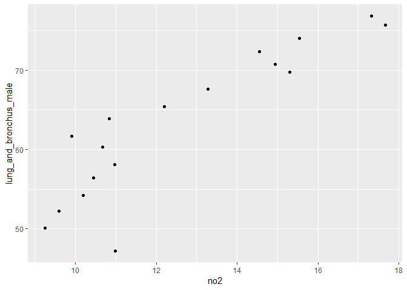<!-- -->

``` r
merged_death_pollution %>% 
  ggplot(aes(x=no2,y=lung_and_bronchus_female)) + geom_point()
```

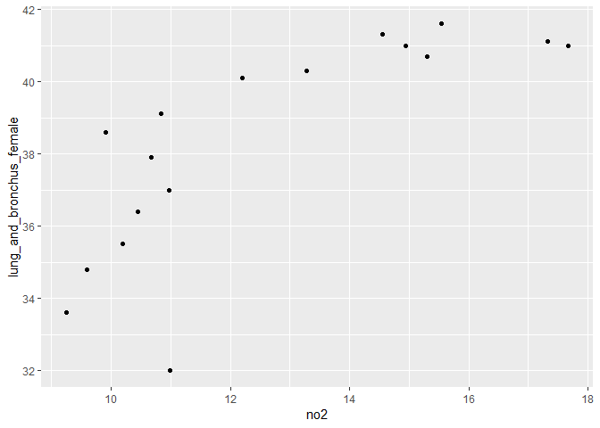<!-- -->

``` r
merged_death_pollution %>% 
  ggplot(aes(x=so2,y=lung_and_bronchus_male)) + geom_point()
```

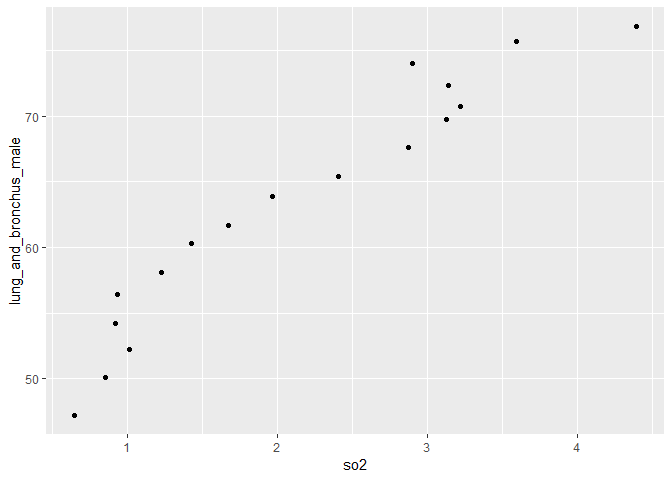<!-- -->

``` r
merged_death_pollution %>% 
  ggplot(aes(x=so2,y=lung_and_bronchus_female)) + geom_point()
```

<!-- -->

``` r
merged_death_pollution %>% 
  ggplot(aes(x=o3,y=lung_and_bronchus_male)) + geom_point()
```

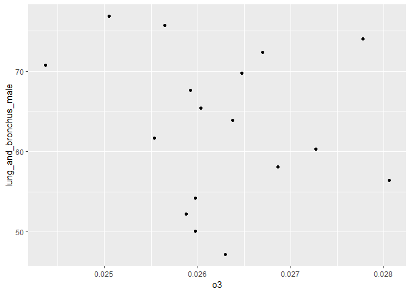<!-- -->

``` r
merged_death_pollution %>% 
  ggplot(aes(x=o3,y=lung_and_bronchus_female)) + geom_point()
```

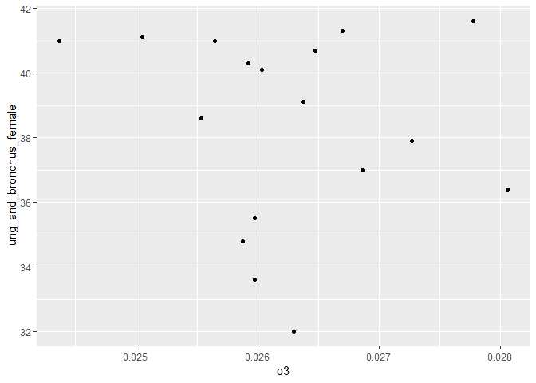<!-- -->

``` r
merged_death_pollution %>% 
  ggplot(aes(x=co,y=lung_and_bronchus_male)) + geom_point()
```

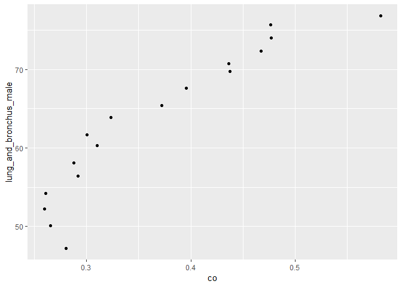<!-- -->

``` r
merged_death_pollution %>% 
  ggplot(aes(x=co,y=lung_and_bronchus_female)) + geom_point()
```

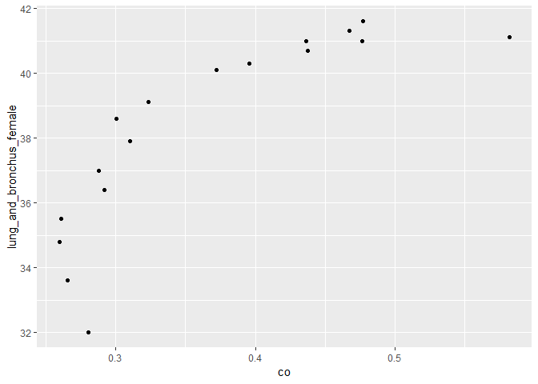<!-- -->

Pollution Trends Nationwide

``` r
no2_trend = 
modified_pollution %>% 
  ggplot(aes(x=year,y=no2, colo)) +
  geom_point() +
  geom_line()
```

``` r
nationwide_so2trend=
  modified_pollution %>% 
  ggplot(aes(x=year,y=so2)) + 
  geom_point() 
```

``` r
nationwide_o3trend=
  modified_pollution %>% 
  ggplot(aes(x=year,y=o3)) +
  scale_color_viridis(discrete=FALSE) +
  theme_bw() +
  geom_point() +
  labs(
    title="Nationwide Trend in Ozone Concentration from 2000-2016",
    x="Year",
    y="Ozone Concentration(ppm)"
  )
```

``` r
nationwide_cotrend=
  modified_pollution %>% 
  ggplot(aes(x=year,y=co)) + 
  geom_point() +
  geom_smooth(se=FALSE) +
  scale_color_viridis(discrete=FALSE) +
  theme_bw() +
  labs(
    title="Nationwide Trend in Carbon Monoxide Concentration from 2000-2016",
    x="Year",
    y="Carbon Monoxide Concentration(ppm)"
  )
```

``` r
pollution = read_csv("data/uspollution_us_2000_2016.csv") %>% 
  janitor::clean_names() %>%
  select(state, date_local, no2_mean, o3_mean, 
         so2_mean, co_mean) %>%
  separate(date_local, into = c("year", "month", "day"), sep = "\\-") %>%
  select(-c("month", "day")) %>%
  group_by(year, state) %>%
  summarize(across(everything(), mean)) %>%
  mutate_if(is.numeric, ~round(., 3)) %>%
  filter(state != "Country Of Mexico") %>% 
  mutate(
    year = as.numeric(year)
  )
```

    ## New names:
    ## * `` -> ...1

    ## Rows: 1746661 Columns: 29

    ## -- Column specification --------------------------------------------------------
    ## Delimiter: ","
    ## chr   (8): Address, State, County, City, NO2 Units, O3 Units, SO2 Units, CO ...
    ## dbl  (20): ...1, State Code, County Code, Site Num, NO2 Mean, NO2 1st Max Va...
    ## date  (1): Date Local

    ## 
    ## i Use `spec()` to retrieve the full column specification for this data.
    ## i Specify the column types or set `show_col_types = FALSE` to quiet this message.

    ## `summarise()` has grouped output by 'year'. You can override using the `.groups` argument.

    ## `mutate_if()` ignored the following grouping variables:
    ## Column `year`

``` r
pollution %>% 
  filter(
    year %in% c("2013","2014","2015","2016")
  ) %>% 
  ggplot(aes(x= year, y=no2_mean, group=state, color=state)) +
  geom_point(alpha=0.5) +
  geom_line()
```

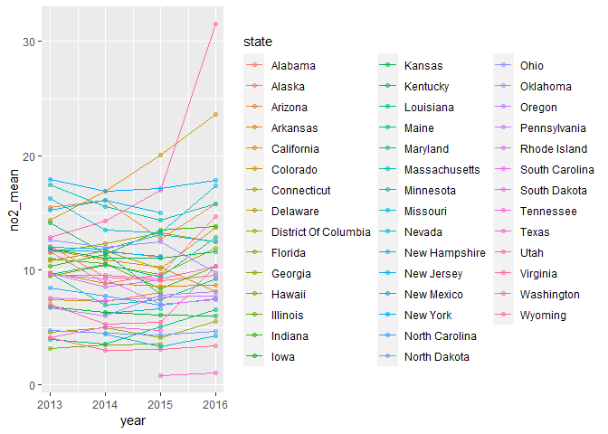<!-- -->

``` r
pollution %>% 
  filter(
    year %in% c("2013","2014","2015","2016")
  ) %>% 
  ggplot(aes(x= year, y=so2_mean, group=state, color=state)) +
  geom_point(alpha=0.5) +
  geom_line()
```

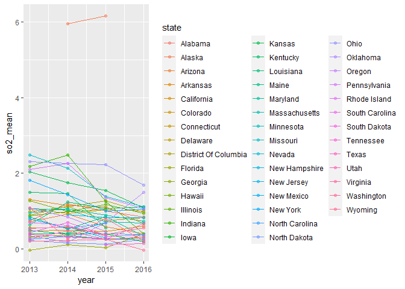<!-- -->

``` r
pollution %>% 
  filter(
    year %in% c("2013","2014","2015","2016")
  ) %>% 
  ggplot(aes(x= year, y=co_mean, group=state, color=state)) +
  geom_point(alpha=0.5) +
  geom_line()
```

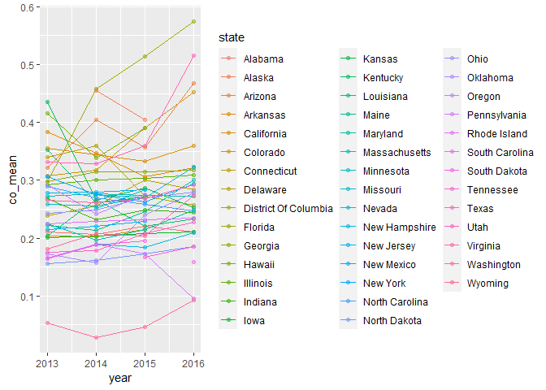<!-- -->

``` r
pollution %>% 
  filter(
    year %in% c("2013","2014","2015","2016")
  ) %>% 
  ggplot(aes(x= year, y=o3_mean, group=state, color=state)) +
  geom_point(alpha=0.5) +
  geom_line()
```

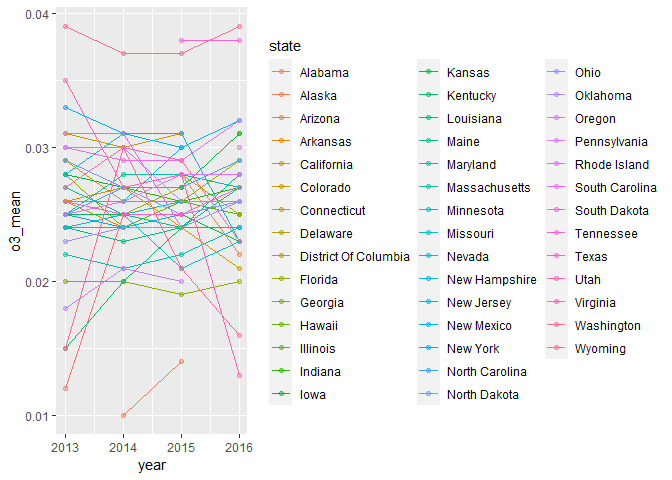<!-- -->
