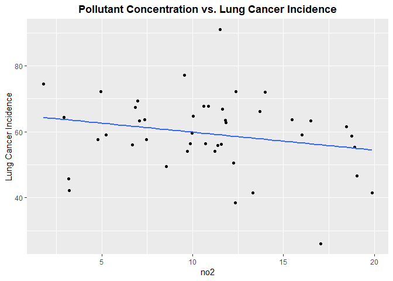
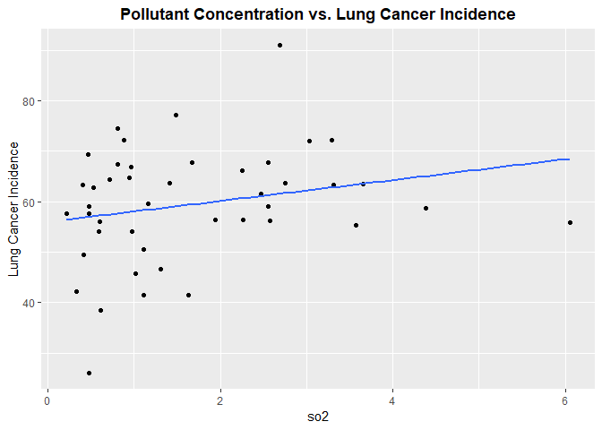
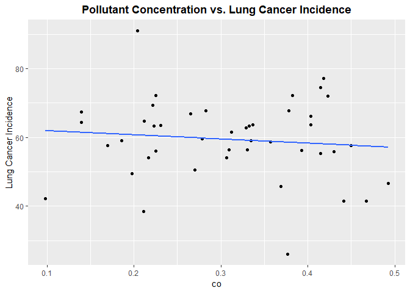
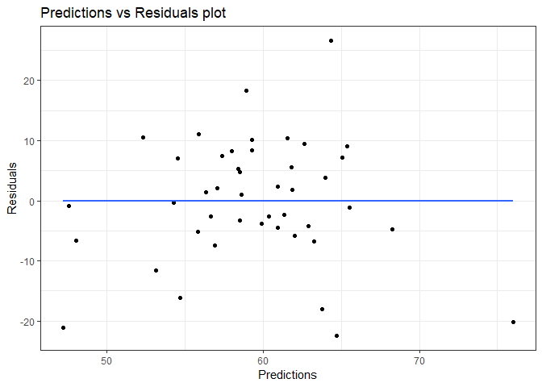
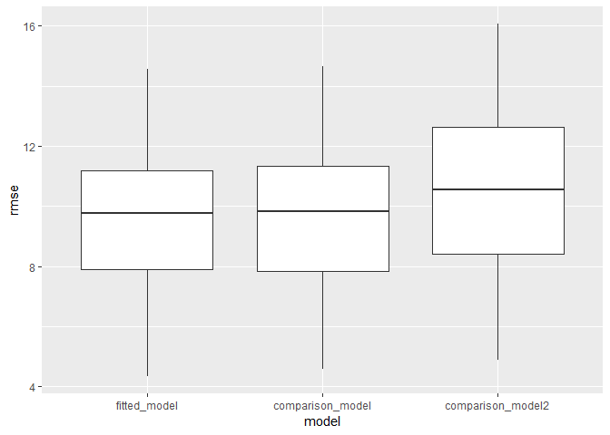

Model Building for Lung Cancer Incidence
================
Matthew Neky & Anand Rajan
12/8/2021

## Importing and Merging Data

``` r
inc_state =
  read_excel("data/IncRate.xlsx", sheet = "State", 
             skip = 6) %>%
  janitor::clean_names() %>% 
  separate(
    col = breast_both_sexes_combined,
    into = c("breast_total", "female_breast_only"),
    sep = "-"
  ) %>% 
  mutate(
    breast_male = if_else(breast_male == "n/a", "0", breast_male),
    cervix_male = if_else(cervix_male == "n/a", "0", cervix_male),
    colon_excluding_rectum_both_sexes_combined = if_else(colon_excluding_rectum_both_sexes_combined == "n/a", "0", colon_excluding_rectum_both_sexes_combined),
    colon_excluding_rectum_female = if_else(colon_excluding_rectum_female == "n/a", "0", colon_excluding_rectum_female),
    colon_excluding_rectum_male = if_else(colon_excluding_rectum_male == "n/a", "0", colon_excluding_rectum_male),
  ) %>%
  filter(state != "Puerto Rico") %>%
  select(-c("female_breast_only", starts_with("colon"), starts_with("rectum")))
```

``` r
pollution_incidence = read_csv("data/uspollution_us_2000_2016.csv") %>% 
  janitor::clean_names() %>%
  select(state, date_local, no2_mean, o3_mean, 
         so2_mean, co_mean) %>%
  separate(date_local, into = c("year", "month", "day"), sep = "\\-") %>%
  select(-c("month", "day")) %>%
  group_by(year, state) %>%
  summarize(across(everything(), mean)) %>%
  mutate_if(is.numeric, ~round(., 3)) %>%
  filter(state != "Country Of Mexico") %>% 
  ungroup() %>% 
  select(state:co_mean) %>% 
  group_by(state) %>% 
  summarize(
    no2 = mean(no2_mean),
    o3 = mean(o3_mean),
    so2 = mean(so2_mean),
    co = mean(co_mean)
  ) %>% 
  merge(inc_state, by = "state") %>% 
  filter(
    state != "Nevada"
  ) %>% 
  mutate(
    lung_and_bronchus_both_sexes_combined = as.numeric(lung_and_bronchus_both_sexes_combined),
    lung_and_bronchus_female = as.numeric(lung_and_bronchus_female),
    lung_and_bronchus_male = as.numeric(lung_and_bronchus_male)
  )


str(pollution_incidence)
```

    ## 'data.frame':    44 obs. of  77 variables:
    ##  $ state                                               : chr  "Alabama" "Alaska" "Arizona" "Arkansas" ...
    ##  $ no2                                                 : num  10.02 11.39 19.03 9.54 13.33 ...
    ##  $ o3                                                  : num  0.0222 0.012 0.0249 0.0257 0.0261 ...
    ##  $ so2                                                 : num  0.945 6.056 1.313 1.483 1.112 ...
    ##  $ co                                                  : num  0.212 0.43 0.493 0.418 0.441 ...
    ##  $ all_cancer_types_combined_both_sexes_combined       : chr  "451.2" "416.9" "386.3" "472.8" ...
    ##  $ all_cancer_types_combined_female                    : chr  "403.3" "403.2" "370.1" "424.8" ...
    ##  $ all_cancer_types_combined_male                      : chr  "517.6" "437.2" "409.8" "537.2" ...
    ##  $ brain_and_other_nervous_system_both_sexes_combined  : chr  "6.2" "6.3" "6" "6.8" ...
    ##  $ brain_and_other_nervous_system_female               : chr  "5.5" "5.6" "4.9" "5.5" ...
    ##  $ brain_and_other_nervous_system_male                 : chr  "7.2" "7" "7" "8.3" ...
    ##  $ breast_total                                        : chr  "121.6 " "120.1 " "114.3 " "118.2 " ...
    ##  $ breast_female                                       : chr  "121.6" "120.1" "114.3" "118.2" ...
    ##  $ breast_male                                         : chr  "0" "0" "0" "0" ...
    ##  $ cervix_both_sexes_combined                          : chr  "9.4" "7.2" "6.5" "9.5" ...
    ##  $ cervix_female                                       : chr  "9.4" "7.2" "6.5" "9.5" ...
    ##  $ cervix_male                                         : chr  "0" "0" "0" "0" ...
    ##  $ colorectum_both_sexes_combined                      : chr  "43.6" "42.9" "32.5" "44.1" ...
    ##  $ colorectum_female                                   : chr  "37.9" "40.7" "28.3" "37.9" ...
    ##  $ colorectum_male                                     : chr  "50.4" "45.1" "37.2" "51.2" ...
    ##  $ esophagus_both_sexes_combined                       : chr  "4.5" "5.8" "4.3" "4.4" ...
    ##  $ esophagus_female                                    : chr  "1.6" "2.9" "1.7" "1.5" ...
    ##  $ esophagus_male                                      : chr  "8.1" "8.8" "7.2" "7.8" ...
    ##  $ hodgkin_lymphoma_both_sexes_combined                : chr  "2.4" "1.8" "2.2" "2.7" ...
    ##  $ hodgkin_lymphoma_female                             : chr  "2.1" "1.6" "1.9" "2.4" ...
    ##  $ hodgkin_lymphoma_male                               : chr  "2.7" "2" "2.5" "3" ...
    ##  $ kidney_and_renal_pelvis_both_sexes_combined         : chr  "17.9" "18.2" "15.9" "20.2" ...
    ##  $ kidney_and_renal_pelvis_female                      : chr  "12.8" "13.7" "10.9" "14" ...
    ##  $ kidney_and_renal_pelvis_male                        : chr  "23.9" "22.6" "21.5" "27.4" ...
    ##  $ larynx_both_sexes_combined                          : chr  "4.1" "2.6" "2.1" "4" ...
    ##  $ larynx_female                                       : chr  "1.6" "0.9" "0.8" "1.8" ...
    ##  $ larynx_male                                         : chr  "7.2" "4.3" "3.7" "6.6" ...
    ##  $ leukemia_both_sexes_combined                        : chr  "12.3" "11.7" "11" "14.5" ...
    ##  $ leukemia_female                                     : chr  "9.7" "9.1" "8.7" "11.2" ...
    ##  $ leukemia_male                                       : chr  "15.6" "14.2" "13.8" "18.5" ...
    ##  $ liver_and_intrahepatic_bile_duct_both_sexes_combined: chr  "7.7" "9.1" "7.9" "7.8" ...
    ##  $ liver_and_intrahepatic_bile_duct_female             : chr  "4.3" "5.5" "4.4" "4.1" ...
    ##  $ liver_and_intrahepatic_bile_duct_male               : chr  "11.9" "12.6" "11.9" "12" ...
    ##  $ lung_and_bronchus_both_sexes_combined               : num  64.8 55.8 46.7 77.2 41.5 41.4 59.6 66.9 57.7 62.8 ...
    ##  $ lung_and_bronchus_female                            : num  50 47.6 43 62.7 37.8 39.6 55.8 60.8 50.5 50.6 ...
    ##  $ lung_and_bronchus_male                              : num  84.1 64.8 51.2 95.8 46.4 44.1 65 75.3 66.5 79 ...
    ##  $ melanoma_of_the_skin_both_sexes_combined            : chr  "21.6" "14.3" "24.5" "21.7" ...
    ##  $ melanoma_of_the_skin_female                         : chr  "17" "12.3" "17.4" "17" ...
    ##  $ melanoma_of_the_skin_male                           : chr  "28.2" "16.7" "33" "28.3" ...
    ##  $ myeloma_both_sexes_combined                         : chr  "7.1" "4.9" "5.1" "6.8" ...
    ##  $ myeloma_female                                      : chr  "6.1" "4" "4" "5.7" ...
    ##  $ myeloma_male                                        : chr  "8.5" "5.8" "6.3" "8.3" ...
    ##  $ non_hodgkin_lymphoma_both_sexes_combined            : chr  "16.2" "17.1" "15.5" "18.2" ...
    ##  $ non_hodgkin_lymphoma_female                         : chr  "13.4" "13.5" "12.9" "15.2" ...
    ##  $ non_hodgkin_lymphoma_male                           : chr  "19.8" "21" "18.5" "22" ...
    ##  $ oral_cavity_and_pharynx_both_sexes_combined         : chr  "13.2" "10.7" "9.2" "13.8" ...
    ##  $ oral_cavity_and_pharynx_female                      : chr  "7.1" "5.9" "4.8" "7.3" ...
    ##  $ oral_cavity_and_pharynx_male                        : chr  "20.3" "15" "14.1" "21.1" ...
    ##  $ ovary_both_sexes_combined                           : chr  "11.5" "9.9" "10.5" "11.2" ...
    ##  $ ovary_female                                        : chr  "11.5" "9.9" "10.5" "11.2" ...
    ##  $ ovary_male                                          : chr  "n/a" "n/a" "n/a" "n/a" ...
    ##  $ pancreas_both_sexes_combined                        : chr  "12.7" "12.7" "11.6" "12.7" ...
    ##  $ pancreas_female                                     : chr  "11" "11.5" "10.1" "10.8" ...
    ##  $ pancreas_male                                       : chr  "14.8" "13.9" "13.4" "14.8" ...
    ##  $ prostate_both_sexes_combined                        : chr  "121" "83.4" "79.1" "112.4" ...
    ##  $ prostate_female                                     : chr  "n/a" "n/a" "n/a" "n/a" ...
    ##  $ prostate_male                                       : chr  "121" "83.4" "79.1" "112.4" ...
    ##  $ stomach_both_sexes_combined                         : chr  "6.8" "8" "5.3" "6.3" ...
    ##  $ stomach_female                                      : chr  "5.1" "5.3" "3.8" "4.3" ...
    ##  $ stomach_male                                        : chr  "8.8" "10.8" "7.1" "8.8" ...
    ##  $ testis_both_sexes_combined                          : chr  "4.3" "6" "5.3" "5.3" ...
    ##  $ testis_female                                       : chr  "n/a" "n/a" "n/a" "n/a" ...
    ##  $ testis_male                                         : chr  "4.3" "6" "5.3" "5.3" ...
    ##  $ thyroid_both_sexes_combined                         : chr  "9.7" "12.4" "13.8" "12" ...
    ##  $ thyroid_female                                      : chr  "14.1" "19.2" "20.9" "17.6" ...
    ##  $ thyroid_male                                        : chr  "5" "6.3" "6.6" "6.3" ...
    ##  $ urinary_bladder_both_sexes_combined                 : chr  "18.3" "21" "18.6" "19.9" ...
    ##  $ urinary_bladder_female                              : chr  "7.5" "8.8" "7.6" "8" ...
    ##  $ urinary_bladder_male                                : chr  "32.7" "34.4" "31.6" "35.1" ...
    ##  $ uterine_corpus_both_sexes_combined                  : chr  "19.9" "24.2" "22.9" "24.1" ...
    ##  $ uterine_corpus_female                               : chr  "19.9" "24.2" "22.9" "24.1" ...
    ##  $ uterine_corpus_male                                 : chr  "n/a" "n/a" "n/a" "n/a" ...

### Linear Models

``` r
model1 = lm(all_cancer_types_combined_both_sexes_combined ~ no2 + o3 + so2 + co, data = pollution_incidence)
model1 %>% broom::glance()
```

    ## # A tibble: 1 x 12
    ##   r.squared adj.r.squared sigma statistic p.value    df logLik   AIC   BIC
    ##       <dbl>         <dbl> <dbl>     <dbl>   <dbl> <dbl>  <dbl> <dbl> <dbl>
    ## 1     0.131        0.0423  30.4      1.47   0.228     4  -210.  432.  443.
    ## # ... with 3 more variables: deviance <dbl>, df.residual <int>, nobs <int>

``` r
model2 = lm(lung_and_bronchus_both_sexes_combined ~ no2 + o3 + so2 + co, data = pollution_incidence)
model2 %>% broom::glance()
```

    ## # A tibble: 1 x 12
    ##   r.squared adj.r.squared sigma statistic p.value    df logLik   AIC   BIC
    ##       <dbl>         <dbl> <dbl>     <dbl>   <dbl> <dbl>  <dbl> <dbl> <dbl>
    ## 1     0.221         0.141  10.7      2.77  0.0407     4  -164.  340.  351.
    ## # ... with 3 more variables: deviance <dbl>, df.residual <int>, nobs <int>

``` r
model3 = lm(colorectum_both_sexes_combined ~ no2 + o3 + so2 + co, data = pollution_incidence)
model3 %>% broom::glance()
```

    ## # A tibble: 1 x 12
    ##   r.squared adj.r.squared sigma statistic p.value    df logLik   AIC   BIC
    ##       <dbl>         <dbl> <dbl>     <dbl>   <dbl> <dbl>  <dbl> <dbl> <dbl>
    ## 1     0.305         0.233  3.52      4.27 0.00581     4  -115.  242.  253.
    ## # ... with 3 more variables: deviance <dbl>, df.residual <int>, nobs <int>

## Building a Model for Lung Incidence

Lets begin by exploring each pollutant to see if there exists linear
relationship between the pollutant concentration and incidence of lung
cancer

``` r
continuous_variables =
  pollution_incidence %>% 
  select(is.numeric) %>% 
  select(-lung_and_bronchus_both_sexes_combined,-lung_and_bronchus_female, -lung_and_bronchus_male) %>% 
  colnames() %>% 
  as.vector()
```

``` r
continuous_variables =
  continuous_variables %>% 
  as.list()

for (i in continuous_variables) {
  plot =
  ggplot(pollution_incidence, aes_string(i,  "lung_and_bronchus_both_sexes_combined")) + 
  geom_point() +
  geom_smooth(method = lm, se = FALSE) +
  labs(title = "Pollutant Concentration vs. Lung Cancer Incidence", y = "Lung Cancer Incidence") +
  theme(plot.title = element_text(hjust = 0.5, face = "bold"))
  
  print(plot)
  
}
```

<!-- --><!-- --><!-- --><!-- -->

From reviewing the scatter plots, none of the pollutants show a
particularly strong linear relationship with incidence of lung
cancer,however we will proceed forward with a model that includes all
the pollutants.

``` r
fitted_model = lm(lung_and_bronchus_both_sexes_combined ~ no2 + o3 + so2 + co, data = pollution_incidence)

fitted_model %>% 
  broom::glance()
```

    ## # A tibble: 1 x 12
    ##   r.squared adj.r.squared sigma statistic p.value    df logLik   AIC   BIC
    ##       <dbl>         <dbl> <dbl>     <dbl>   <dbl> <dbl>  <dbl> <dbl> <dbl>
    ## 1     0.221         0.141  10.7      2.77  0.0407     4  -164.  340.  351.
    ## # ... with 3 more variables: deviance <dbl>, df.residual <int>, nobs <int>

``` r
fitted_model %>% 
  broom::tidy() %>% 
  select(term, estimate,p.value) %>%
  knitr::kable(digits=3)
```

| term        | estimate | p.value |
|:------------|---------:|--------:|
| (Intercept) |   62.537 |   0.000 |
| no2         |   -1.034 |   0.034 |
| o3          |  126.200 |   0.768 |
| so2         |    4.561 |   0.006 |
| co          |   -9.008 |   0.651 |

As we see the p-values for each of the slopes are significant except the
slope for Carbon Monoxide. Moreover, the p-value for the overall model
is significant(p-value=0.0126). Thus we will continue with the current
model and compared to other comparison models

``` r
pollution_incidence %>% 
  add_residuals(fitted_model) %>% 
  add_predictions(model2) %>% 
  ggplot(aes(x=pred, y=resid)) +
  geom_point() +
  geom_smooth(method = "lm", se = FALSE) +
  labs(
    title= "Predictions vs Residuals plot",
    x="Predictions",
    y="Residuals"
  ) +
  scale_color_viridis(discrete=TRUE) +
  theme_bw()
```

<!-- -->
From the plot we see the assumption of homescedasticity is not violated,
thus we can proceed forward with this model.

Comparison Models

``` r
comparison_model = lm(lung_and_bronchus_both_sexes_combined ~ no2 + o3 + so2, data = pollution_incidence)  
comparison_model2 = lm(lung_and_bronchus_both_sexes_combined ~ o3 + so2, data = pollution_incidence) %>% 
  broom::tidy()
```

## Cross Validate

``` r
cv_df = crossv_mc(pollution_incidence,100) 

cv_df =
  cv_df %>% 
  mutate(
    train=map(train,as_tibble),
    test=map(test,as_tibble)
  )
```

``` r
cv_df = 
  cv_df %>% 
  mutate(
    fitted_model = map(train, ~lm(lung_and_bronchus_both_sexes_combined ~ no2 + o3 + so2 + co, data = pollution_incidence)),
    comparison_model = map(train, ~lm(lung_and_bronchus_both_sexes_combined ~ no2 + o3 + so2, data = pollution_incidence)),
    comparison_model2  = map(train, ~lm(lung_and_bronchus_both_sexes_combined ~ o3 + so2, data = pollution_incidence))) %>% 
  mutate(
    rmse_fitted_model = map2_dbl(fitted_model, test,~rmse(model=.x, data=.y)),
    rmse_comparison_model = map2_dbl(comparison_model, test, ~rmse(model=.x, data=.y)),
    rmse_comparison_model2 = map2_dbl(comparison_model2, test, ~rmse(model=.x, data=.y))                            
  )

cv_df %>% 
  select(starts_with("rmse")) %>% 
  pivot_longer(
    everything(),
    names_to = "model", 
    values_to = "rmse",
    names_prefix = "rmse_") %>% 
  mutate(model = fct_inorder(model)) %>% 
  ggplot(aes(x = model, y = rmse)) + geom_boxplot()
```

<!-- -->

``` r
female_model = lm(lung_and_bronchus_female ~ no2 + o3 + so2 + co, data=pollution_incidence)

female_model %>% 
  broom::glance()
```

    ## # A tibble: 1 x 12
    ##   r.squared adj.r.squared sigma statistic p.value    df logLik   AIC   BIC
    ##       <dbl>         <dbl> <dbl>     <dbl>   <dbl> <dbl>  <dbl> <dbl> <dbl>
    ## 1     0.195         0.112  9.13      2.36  0.0703     4  -157.  326.  337.
    ## # ... with 3 more variables: deviance <dbl>, df.residual <int>, nobs <int>

``` r
model_male = lm(lung_and_bronchus_male ~ no2 + o3 + so2 + co, data=pollution_incidence) 

model_male %>% 
  broom::glance()
```

    ## # A tibble: 1 x 12
    ##   r.squared adj.r.squared sigma statistic p.value    df logLik   AIC   BIC
    ##       <dbl>         <dbl> <dbl>     <dbl>   <dbl> <dbl>  <dbl> <dbl> <dbl>
    ## 1     0.218         0.138  14.0      2.72  0.0433     4  -176.  364.  374.
    ## # ... with 3 more variables: deviance <dbl>, df.residual <int>, nobs <int>
